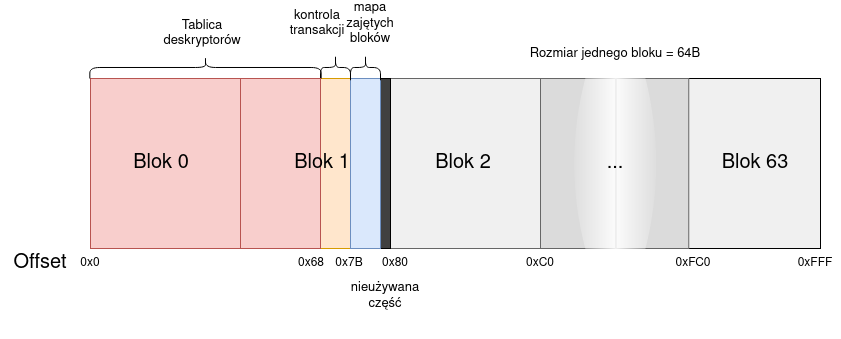

# Zadanie 5 - System Plików

SOI 22Z Tomasz Sroka

## Informacje

Zaprojektowano system plików dla małych urządzeń (np. karta stykowa). Przewidziany rozmiar pamięci to **4KB**.

Założenia:
* Urządzenie obsługuje atomowy odczyt i zapis słowa 16 bit z/do pliku
* Alokacja ciągła, jednostka alokacji ma rozmiar 64B
* Dostępne są operacje:
	* otwieranie pliku - dostajemy uchwyt do pliku i nim się posługujemy. Nieistniejący plik jest tworzony.
	* zamykanie pliku
	* przesunięcie obecjej pozycji kursora 
	* odczytanie obecnej pozycji kursora względem początku pliku
	* usuwanie pliku
	* zmiana nazwy pliku.
* Nazwa plików to unikalny **ciąg pięciu znaków**, na przykład `minix`
* Nie ma trybów otwierania pliku bp. 'r' 'w+' itd., z otwartym plikiem można robić wszystko, a kursor domyślnie jest na początku pliku
* Jest możliwośc nadpisywania pliku z dowolnego miejsca, ale **może się to skończyć zniszczeniem pliku w przypadku błędu zapisu**. Jedynie dopisywanie do pliku na końcu jest 100% bezpieczne.
	* Ta możliwośc jest udostępniona, bo może jest potrzeba wpisania w środku pliku atmowowo tylko 2 bajty.
	

## Szczegóły implementacyjne

Pierwsze dwie jednostki alokacji są wykorzystane na inne dane niż dane użytkownika, większość miejsca zajmuje tablica deskryptorów, reszta miejsca to część używana przy transakcjach, oraz mapa zajętych jednostek.

Pierwsza część 104B to tablica deskryptorów pliku, jest w stanie przechować dokładnie 13 deskryptorów.
(jeden ma rozmiar 8B)

```C
struct FileDesc {
  char fileName[5];					// 0x0 nazwa pliku
  uint8_t fileSize[2];				// 0x5 rozmiar w bajtach
  uint8_t startingBlockIndex;		// 0x7 indeks pierwszej jednostki alokacji
};
```

!!! gdy fileName[0]=='\0', oznacza to, że dane miejsce na deskryptor nie jest używane.

Druga częśc to "blok kontrolny", zawiera różne informacje o transakcji, jest tutaj też mapa zajętych jednostek

```C
struct ControlBlock{
	struct TransactionStatus {
		uint8_t isActive;			// 0x0	czy tranzakcja jest w trakcie (jeżeli True = nie ukończona)
		char newName[5];			// 0x1	nowa nazwa
		uint16_t newSize;			// 0x6	nowy rozmiar
		uint8_t descriptorIndex;	// 0x8	indeks deskryptora, którego plik jest zmieniany
	};
	uint64_t usedBlocks				// 0x9-0x17	maska bitów, które bloki są w użyciu
};
```

Maksymalny rozmiar pliku według pola `fileSize` to 2^16 bajtów, ale w rzeczewistości prawdziwy limit to **3968B** (rozmiar karty minus dwa specjalne bloki).

# Mapa pamięci

Cały dysk ma taką strukturę
```C
struct DiskImage {
  FileDesc table[13];
  ControlBlock control;
  uint8_t unused[7]; // stracone miejsce
  AllocBlock blocks[62];
};
```

blok 0 i 1 to wyżej opisane części (1/32 całości), a pozostałe 62 bloki są do wykorzystania przez pliki.

* Tablica deskryptorów: 104B (2,53%)
* Blok kontrolny: 17B (0,41%)
* Zmarnowane miejsce: 7B (0,17%)
* Miejsce na dane: 3968B (96,87%)




## Dodatkowe informacje

Typ `File` - identyfikator uchwytu do pliku, tak naprawdę to jest liczba, która sama w sobie dla programisty nie ma sensu, ale służy jako identyfikator piku, który wcześniej otwyrzyliśmy.

Typ `Error` jest np. typem wyliczeniowym, albo klasą bazową dla specyficznych błędów.

## Opis kontrolera i funkcji bibliotecznych dla plików

Kontroler karty posiada w swojej pamięci RAM tablicę obecnie otwartych plików. Jest to lista takich struktur:
```C
struct OpenedFile {
	uint8_t descriptorIndex;	// -1 oznacza nieuzywany
	uint16_t seekOffset;
};

OpenedFile openedFiles[13];	// otwarte pliki
```

Funkcja `File open(char name[5])`


Jeżeli komunikacja zostanie zerwana w dowolnym momencie, zwracamy błąd `OpenError`

```C
1.	Znajdź w tablicy deskryptorów plik z podaną nazwą
2.	Jeżeli nie znaleziono to:
3. 		wolnyIndeks = pierwsze możliwe miejsce w tablicy deskryptorów
4.		Uzupełnij blok tranzakcji nowymi danymi:
			newName = name
			rozmiar=0
			descriptorIndex= wolnyIndeks
5.		TransactionStatus.isActive=1
6.		Transaction();
7.	Dodaj znaleziony deskryptor do tablicy openedFiles
8.	Zwróć indeks w tablicy `openedFiles` jako `File`
```


Funkcja `File close(File file)`

```C
1.	openedFiles[file]=-1;
```

Funkcja `Error read(File file, size_t byteCount, char* destination)`

`destination` - wskaźnik do bufora o rozmiarze przynajmniej byteCount

```C
1.	Znajdź w `openedFiles` dany plik, jeżeli nieprawidłowy uchwyt/plik nie jest otwarty, zwróć `FileError`
2.	Jeżeli fileSize-seekOffset<byteCount, zwróć `FileTooShortError` (plik jest za krótki)
3.	Dopóki nie odczytano byteCount bajtów:
4.		Odczytaj 16 bitów z pamięci, wpisz do bufora
5.		Jeżeli komunikacja się zerwie, zwróć `ReadError`
6.		Przesuń wskaźnik pliku oraz bufora
7.	Zwróć `OK`
```

Funkcja `Error write(File file, size_t byteCount, char* source)`

```C
1.	Znajdź w `openedFiles` dany plik, jeżeli nieprawidłowy uchwyt/plik nie jest otwarty, zwróć `FileError`
2*.	Jeżeli nie ma miejsca na wpisanie wszystkich danych, zwróć `NotEnoughSpaceError`
3.	Czytaj w pętli `byteCount` bajtów z bufora do pamięci.
4.	Uzupełnij blok tranzakcji nowymi danymi:
		newName= obecna nazwa
		size=size+byteCount
		descriptorIndex= odczytac z 1.
5.	TransactionStatus.isActive=1;
6.	Transaction()
7.	Zwróć `OK` jeżeli nie było błedu
```

W punkcie drugim należy zastanowić się które jednostki alokacji są dostępne, a dokładniej, czy jest ich wystarczająca ilośc za obecnym rozmiarem pliku. Do tego potrzebny jest następujący algorytm:

```C
1. 	pierwszy = startingBlockIndex+fileSize/64
2.	ostatni = startingBlockIndex+(fileSize+byteCount)/64
3.	sprawdź, czy każdy bit w ControlBlock.usedBlocks między pierwszym wyłącznie i ostatnim włącznie nie jest ustawiony (czy te bloki są wolne)
```


Funkcja `unsigned seek(File file, short offset, bool relative)`

```C
1.	if offset=-1:
2.		d = openedFiles[file].desctiptorIndex;
3.		openedFiles[file].seekOffset=descriptors[d].fileSize;
4.	else if relative:
5.		openedFiles[file].seekOffset+=offset;
6.		// ogranicz do 0<=seekOffset<fileSize		
7.	else if offset>=0:
8.		openedFiles[file].seekOffset=offset;
```

Funkcja `unsigned short tell(File file)` - zwraca `openedFiles[file].seekOffset`


Funkcja `Error delete(char filename)`

```C
1.	Znajdź w tablicy deskryptorów deskryptor o tej nazwie
2.	Jeżeli ten plik jest otwarty (trzeba znaleźć czy jakiś uchwyt do pliku w pamięci wskazuje na niego), zwróć `FileError`, w przeciwnym wypadku wpisz nowe dane transakcji:
		newName = '\0'
		size = 0 (cokolwiek)
		descriptorIndex = indeks z 1.
4.	TransactionStatus.isActive=1;
5.  Transaction()
6.	Zwróć `OK` jeżeli nie było błedu
```

Funkcja `Error rename(char originalName[4], char newName[4])`


```C
1. 	Znajdź deskryptor tego pliku w tablicy na podstawie originalName
2. 	Ustaw w TransactionStatus:
		 newSize = obecny rozmiar
		 descriptorIndex = indeks z 1.
		 newName = newName
4.	TransactionStatus.isActive=1;
5.	Transaction()
8.	Zwróć `OK`
```

## Wykonywanie transakcji

Ta procedura jest wykonywana podczas tworzenia nowego pliku, dopisywania danych do pliku, lub zmiany nazwy. W przypadku zerwania łączności, również od razu po zamontowaniu systemu plików.


Funkcja `Error Transaction()`:

W każdym momencie łączność może zostać utracona, wtedy zwraca `TransactionError`

```C
1.	Jeżeli TransactionStatus.isActive==0, zwróć `OK`
2.	Jeżeli pole newName=='\0': // przerwano podczas usuwania
3.		Wyczyśc bity jednostek zajmowanych przez plik
4.		Ustaw nazwę na '\0'
5.	Jeżeli newSize==0:  //przerwano podczas tworzenia pliku
6.		Jeżeli startingBlockIndex == 0:
7.			startingBlockIndex = pierwszy bit 0 w `usedBlocks`
8.		ControlBlock.usedBlocks|= startingBlockIndex
9.	W przeciwnym wypadku: //przerwano podczas zmiany nazwy, albo wpisywania
10.		Ustaw wszystkie używane przez plik bloki jako zajęte w `usedBlocks`.
11.		Przepisz nową nazwę
12.	Przepisz nowy rozmiar
13.	TransactionStatus.isActive=0;
14.	Zwróć `OK`
```

Po zamontowaniu plików jest krótkie sprawdzenie czy wymagana jest transakcja:

```C
1. 	Jeżeli TransactionStatus.isActive:
2.		Transaction()
```